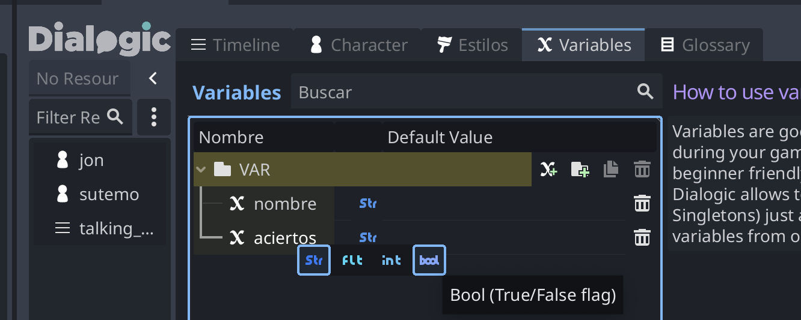
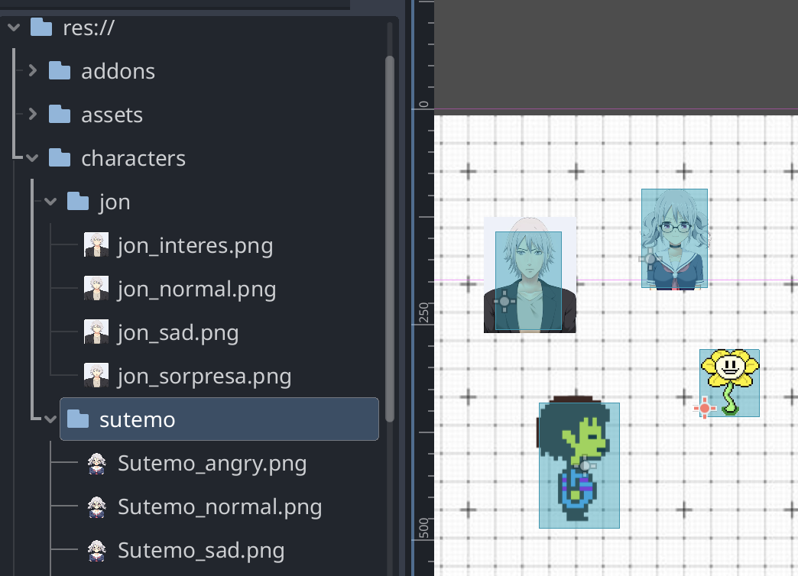
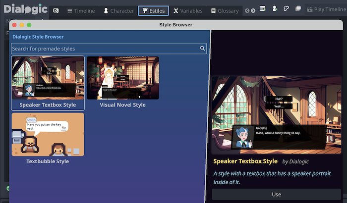

## Dialogic 2 example 

Ejemplo de sistema de diálogo en Godot con plugin Dialogic 2 https://github.com/dialogic-godot/dialogic

Documentación en: https://docs.dialogic.pro/introduction.html

Ejemplo base para diseñar diálogos: [walking_player_con_dialogic.zip](walking_player_Dialogic.zip)

Usamos como personajes para el dialogo los siguientes character: 
* Sutemo https://sutemo.itch.io/female-character 
* Jon: https://sraye.itch.io/mature-male-character-sprites

### Variables globales 

EN el editor se pueden crear variables globales que se pueden usar durante la conversación, pueden tener difernetes tipos (string, int, bool)

En cualquier momento se pueden usar poniendolas entre llaves: 

``{VAR.nombre}`` o bien ``{nombre}``

### Dialogos (timeline)

Un timeline describe un diálogo. se almacena con extensión **.dtl**

Acciones que se pueden hacer en un diálogo:

### Inicar diálogo desde Godot 

``Dialogic.start("nombre_dialogo")``

### Characters 

Al crear los characters, todas las imágenes del personaje deben estar en una carpeta (expresiones) 

Cada personaje se crea con una extensión **.dch**

### Estilos de diálogo (bubble) 

Se pueden usar varias que viene prediseñadas o hacer una propia 

