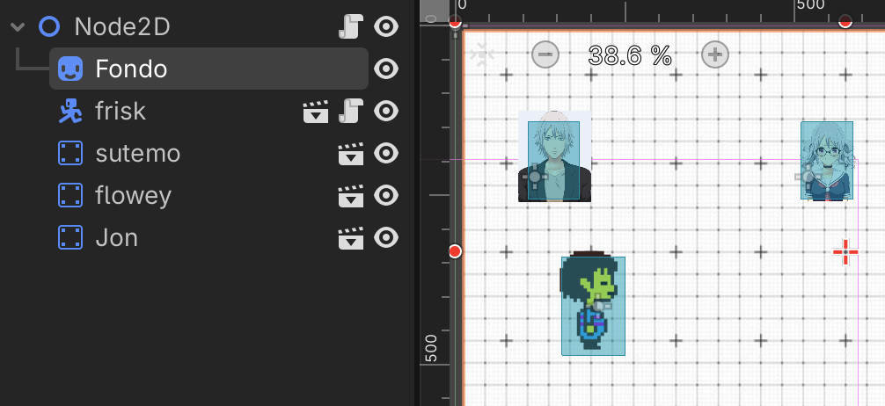
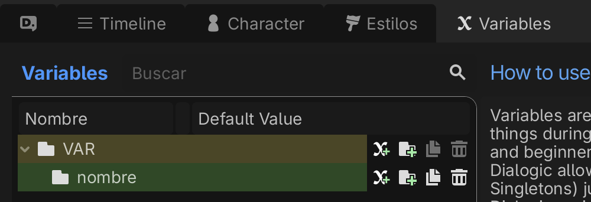
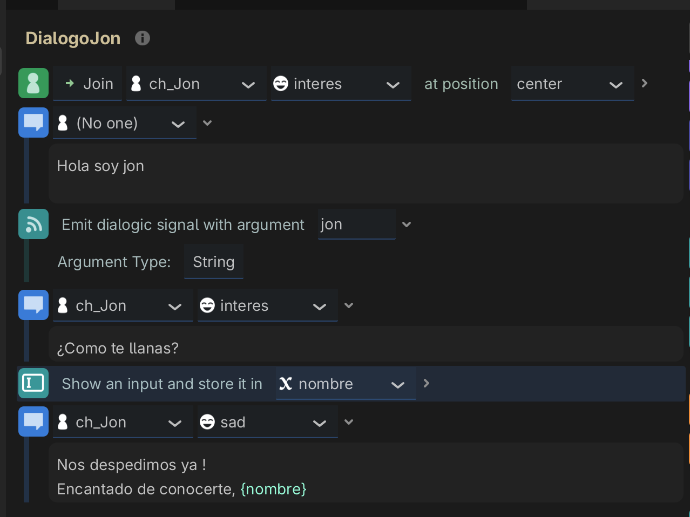
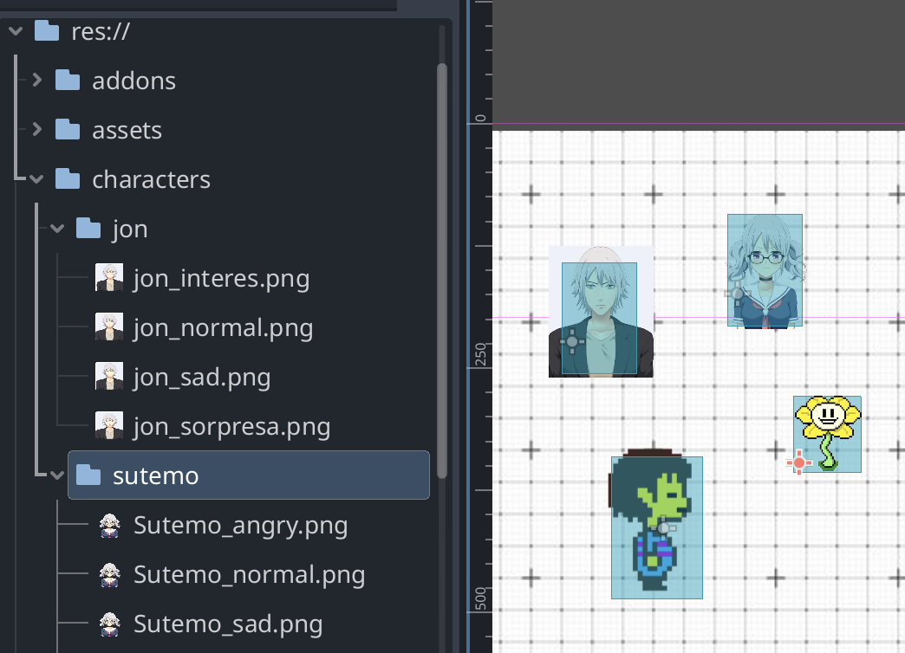
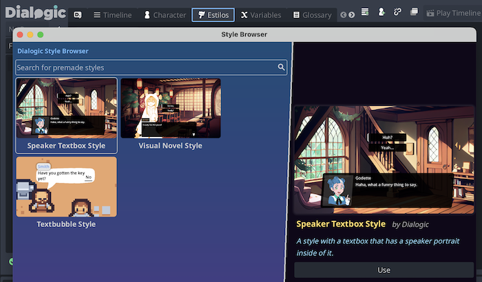

## Dialogic 2 example 

* Ejercicio sin dialogos: [Dialogic_walking_player.zip](walking_player_Dialogic.zip)
* Ejercicio con diálogo conectado a colision: [Dialogic_walkingPlayer_Jon.zip]([Dialogic_walkingPlayer_Jon.zip])

Ejemplo de sistema de diálogo en Godot con plugin Dialogic 2 https://github.com/dialogic-godot/dialogic

  * Documentación en: https://docs.dialogic.pro/introduction.html

[¿Qué es Dialogic?](https://github.com/mgea/godot/wiki/Dialogic-%28Dialog-System%29) 


Creación de un player que se mueve en un entorno 2D y "choca" con personajes con los que habla. Usamos como personajes para el dialogo los siguientes character: 
* Sutemo https://sutemo.itch.io/female-character 
* Jon: https://sraye.itch.io/mature-male-character-sprites




### Variables globales 

EN el editor se pueden crear variables globales que se pueden usar durante la conversación, pueden tener difernetes tipos (string, int, bool)



En cualquier momento se pueden usar poniendolas entre llaves: 

``{VAR.nombre}`` o bien ``{nombre}``


### Dialogos (timeline)

Un timeline describe un diálogo. se almacena con extensión **.dtl**




Acciones que se pueden hacer en un diálogo:


En este caso, se utliza un ``text_input`` para introducir el nombre del  usuario y guardarlo en una variable ``nombre`` 


### Inicar diálogo desde Godot 

EN cualquier momento del código se puede llamar a: 

``Dialogic.start("nombre_dialogo")``

### Señales 

En cualquier momento del Diálogo se pueden **emitir señales** a las cuales se le ponen un nombre (string) para usar posteriormente 

Eh este caso, las señales no se pueden manejar desde el panel de Señales de Godot, sino que **hay que introducirlas manualmente** en el código gdscript. 


```gdscript
 # En el script de la escena principal, se activa la señal y se introduce la función para gestionarla 
 func _ready() -> void:
	Dialogic.signal_event.connect(_on_dialogic_signal)

# funcion de manejar señales emitidas desde el Diálogo 
func _on_dialogic_signal(argument:String):
  if argument == "jon":
		   print("Hablando con Jon (señal emitida)")


```


### Characters 

Al crear los characters, todas las imágenes del personaje deben estar en una carpeta (expresiones) 



Cada personaje se crea con una extensión **.dch**

Cuando aparecen en el diálogo al hablar, se puede seleccionar su variante (sad, happy...) 

### Estilos de diálogo (bubble) 

Se pueden usar varias que viene prediseñadas o hacer una propia  (más adelante)




