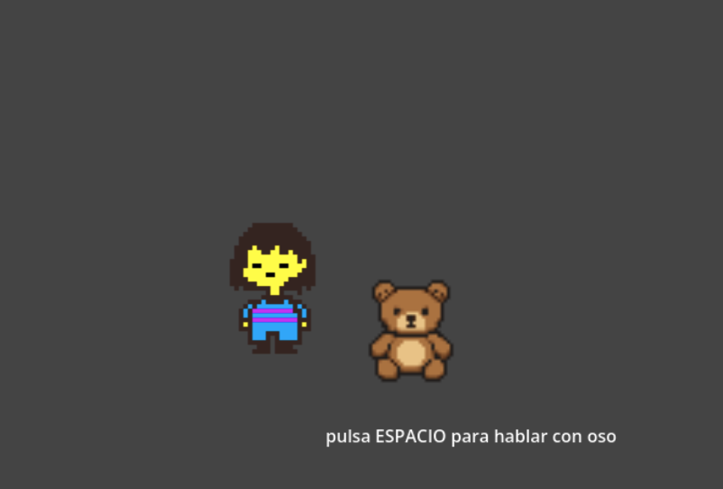

## Dialogic_open_player_key

Ejemplo que mueve un player y un "NPC dialogable" sin colisiones

- demo en itc.io -> https://cmiugr.itch.io/dialogic-open-key
- Descargar: [Dialogic_open_player_key.zip](Dialogic_open_player_key.zip)


Cuando el player "se acerca" se activa la opción de hablar pulsando tecla
- cuando está cerca de un objeto (no choca con el) -> Area2D
- se debe pulsar una tecla, p.e espacio

**Tips**: Si se quiere ver las zonas de colisión para comprobar funcionamiento, se pueden activar/desactivar en ``Menu->Depurar->Ver zonas de colisión``

 

##### Personaje NPC Dialogable 

Señales: 
* on_area_2d_body_entered / on_area_2d_body_exited
  Detectan si el player está dentro de su "espacio" ColisionShape
  se pone una variable "player_inside = true o false"

* on_area_2d_mouse_entered / on_area_2d_mouse_exited
  Cambia de tamaño cuando se acerca mouse (no tiene más efectos)

* en _process() se hace la combrobación de pulsar tecla (mas eficiente) 
   si la variable player_inside es true

* comprueba si pulsa ESPACIO 
	if Input.is_action_just_pressed("ui_accept") and player_inside:
		# comenzar diálogo al pulsar espacio
		print("ESPACIO")
		Dialogic.start("dialogo_oso")


```gdscript
# dialogable.gd
extends Node2D

@export var nombre_objeto:String
@export var texture:Texture2D

var player_inside = false

@export var escala_normal: Vector2 = Vector2(1, 1)
@export var escala_grande: Vector2 = Vector2(1.2, 1.2) # 20% más grande
@export var tiempo_animacion: float = 0.2
@onready var sprite = $Area2D/Sprite2D


# Called when the node enters the scene tree for the first time.
func _ready() -> void:
	print(texture)
	$Area2D/Sprite2D.texture = texture
	$Area2D/Sprite2D.visible = true


# Called every frame. 'delta' is the elapsed time since the previous frame.
# comprueba si se ha hecho click con el ratón para lanzar dialogo
func _process(delta: float) -> void:
	# comprueba si pulsa ESPACIO 
	if Input.is_action_just_pressed("ui_accept") and player_inside:
		# comenzar diálogo al pulsar espacio
		print("ESPACIO")
		Dialogic.start("dialogo_oso")


func _on_area_2d_mouse_entered() -> void:
	var tween = create_tween()
	tween.tween_property(self, "scale", escala_grande, tiempo_animacion).set_trans(Tween.TRANS_SINE)
	print("in")

func _on_area_2d_mouse_exited() -> void:
	# Volvemos al tamaño original
	var tween = create_tween()
	tween.tween_property(self, "scale", escala_normal, tiempo_animacion).set_trans(Tween.TRANS_SINE)
	print("out")


func _on_area_2d_body_entered(body: Node2D) -> void:
	# ha entrado player en área 
	print("ha entrado ---> ", body.name) 
	var tween = create_tween()
	tween.tween_property(self, "scale", escala_grande, tiempo_animacion).set_trans(Tween.TRANS_SINE)
	# está dentro y se puede  pulsar ESPACIO 
	player_inside=true
	$mensaje.text="pulsa ESPACIO para hablar con oso"


func _on_area_2d_body_exited(body: Node2D) -> void:
	# ha salido player del área 
	print("ha salido ---> ", body.name) 
	var tween = create_tween()
	tween.tween_property(self, "scale", escala_normal, tiempo_animacion).set_trans(Tween.TRANS_SINE)
	# está fuera y NO se puede  pulsar ESPACIO 
	player_inside=false
	$mensaje.text=""

```


