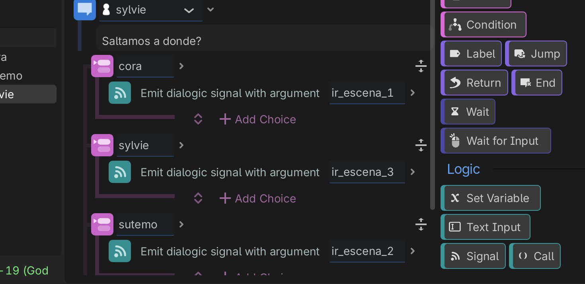

## Dialogic_signals

Ejemplo que explica cómo conectar desde Dialogic con godot (p.e. para cambiar de escena)

Se hace con señales

ver en itch.io https://cmiugr.itch.io/dialogic-signals


```gdscript
extends Node2D

### conectamos señales 

# Called when the node enters the scene tree for the first time.
func _ready() -> void:
	# creamos conexión 
	Dialogic.signal_event.connect(_on_dialogic_signal)


# señal emitida desde Dialogic (añadir manualmente)
func _on_dialogic_signal (argument:String):
	if argument== "ir_escena_2":
		print("saltar a escena 2 desde Dialogic")
		get_tree().change_scene_to_file("escena2.tscn")
	if argument== "ir_escena_3":
		print("saltar a escena 3 desde Dialogic")
		get_tree().change_scene_to_file("escena3.tscn")
	if argument== "ir_escena_1":
		print("saltar a escena 1 desde Dialogic")
		get_tree().change_scene_to_file("escena1.tscn")
		
		

```

Se crea la señal en Dialogic, el argumento es el que define qué hacer 



[Info de señales en dialogic](https://github.com/mgea/godot/wiki/Dialogic-(Dialog-System))
