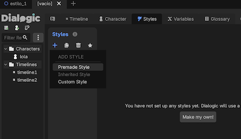
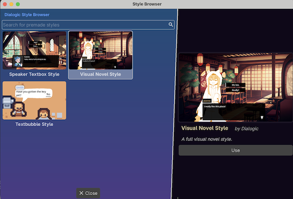
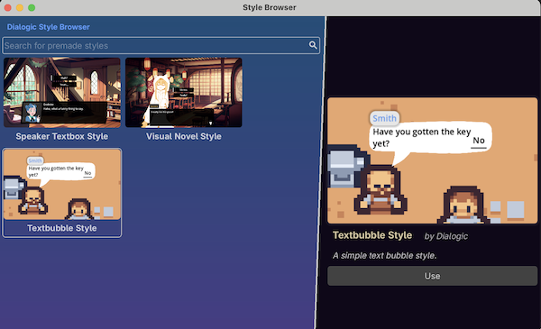
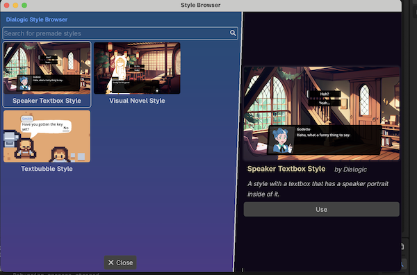

# Estilos de dialogos (Dialogic 2 Dialog System plugin)

Fuente: [Dialogic_VisualNovel_style](dialogic_VN_estilos.zip)

VIdeo (oficial) explicativo: https://www.youtube.com/watch?v=TLnzSzqBwu4

de: https://docs.dialogic.pro/styles-and-layouts.html#32-custom-layout-scenes


Se puede personalizar el estilo de diálogo en ``Dialogic->Styles``





Tipos de Estilos:
* **Novela Visual**: Diseño por defecto  con caja de texto inferior, nombre y retrato del personaje por detrás. 




* **Burbuja de texto** (Bubble Style): Burbujas que siguen al personaje, ideales para RPGs o top-down.




* Tipo **Speaker** con Imagen/Retrato: Estilos que integran imágenes dentro o junto a la caja de texto.Personalización: Dentro del editor de estilos, puedes modificar colores, tamaños de fuente, etiquetas de nombre, sonidos indicadores y capas.




Personalización: Dentro del editor de estilos, puedes modificar colores, tamaños de fuente, etiquetas de nombre, sonidos indicadores y capas.


Gestión: Los estilos **se pueden editar en el Style Editor** y aplicarse a personajes específicos o a toda la línea de tiempo (timeline).


Ver resultado: https://cmiugr.itch.io/dialogic-styles


Cuando haces un layout custom en Dialogic 2.


Ejemplo:

```
var layout = Dialogic.start("dialogo_bubble")
layout.register_character(character, node)

character = .dch
node = 2dnode  de tipo $BullbleMark

```


Lo más fácil suele ser:

✅ un bubble scene por personaje
 ✅ posicionarlo manualmente
 ✅ conectar Timeline events


info: 
* Documentacion: https://docs.dialogic.pro/custom-portraits.html
* Dive into Dialogic Godot Addon: A Fast Guide https://www.youtube.com/watch?v=7PuPU0Mrl_g
* Dialogic 2 - Styles Tab - Godot 4 https://www.youtube.com/watch?v=WTeDyV_Yr-I
* https://www.youtube.com/watch?v=TLnzSzqBwu4
* Create a Complete Dialogue System in Godot 4 (step by step) https://www.youtube.com/watch?v=Tmy1tzhDLl4

