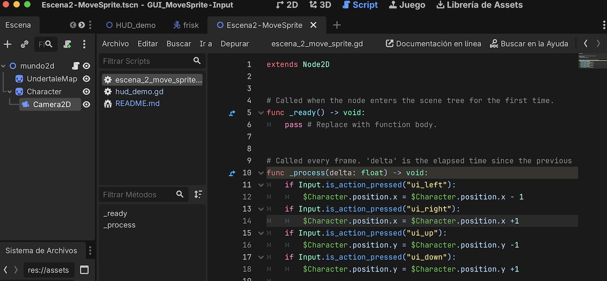
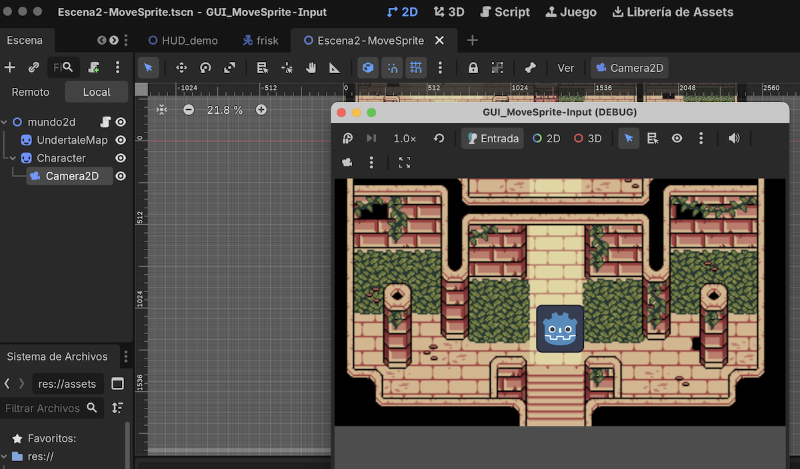

## GUI-MoveSprite-Inputs

En este ejercicio vamos a  controlar un objeto (``sprite2D``)  por la pantalla mediante los ``Inputs``: pulsaciones en dispositivos de entrada (teclado, mouse,...) 
Mover objeto básico por teclado / ratón

Revisar qué son y cómo funciona los [Inputs](https://github.com/mgea/godot/wiki/Inputs)

NOTA: EL script se ha puesto en el Nodo raiz. Para modificar propiedades de los "nodos hijos" tenemos que usar un mecanimo para referirnos al nodo hijo correspondiente. Ene este caso, sería usando el símbolo ``$`` con el nombre del nodo: para mover a la derecha el ``Sprite2D`` sería con: ``$Character.position.x = $Character.position.x +1`` 

Finalmente le añadiremos un objeto ``Camera2D`` para que se mueva con el personaje 

 

POdemos añadir más opciones para evitar que el personaje no se salga de las dimensiones del mapa. 

