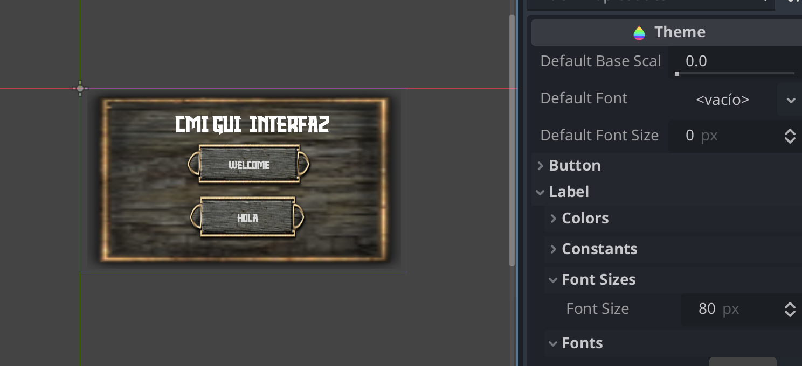

## GUI CMI 

Diseño del UI: 

- Layout y componentes

- Apariencia (themes)

* Button
* Label
* Panel

Cambiar estilo de componentes con Themes. 

Uso de tilesheets personalizados. 

https://opengameart.org/content/rpg-gui-construction-kit-v10

 

Uso de Fonts: 

 
https://www.fontspace.com/knight-warrior-font-f104596

