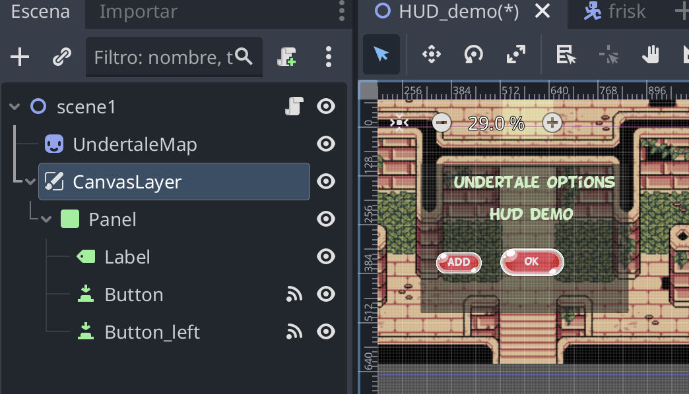
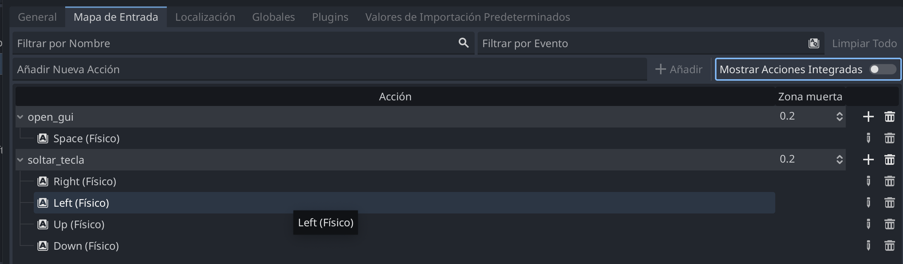

#  HUD (Head Up Display) Panel 


Código en [hud_panel.zip](hud_panel.zip)

En este ejemplo, vamos a crear un diseño de UI creando un estilo propio (que se llama **Theme**) y que se pueda organizar y manejar  como un **panel independiente** del juego 2D. 

Con este ejercicio comprenderemos: 

* cómo crear paneles de UI
* cómo crear y aplicar un Theme al diseño 

Revisar: 
* [¿Qué es un Theme?](https://github.com/mgea/godot/wiki/Tema)
* [¿Qué es un Panel?](https://github.com/mgea/godot/wiki/Panel) 


## Creación del Panel 

Creación de un panel de IU para juego https://es.wikipedia.org/wiki/HUD_(videojuegos)

Es la información que se muestra en juego durante la partida 

Puede estar siempre visible o alternar visibilidad (aparecer/ocultar)


Se abre cierra con teclado:

* Barra de espacio : abrir /cerrar


## Aplicación de un Theme (creación) 


Vamos a crear un theme (.tres) con los siguientes elementos: 

- Buscar fonts personalizada  disponible de https://www.dafont.com/es/

  Font elegida: CARTOON SHOUT   https://www.dafont.com/es/bd-cartoon-shout.font

- GUI theme prediseñado (free GUI spritesheet)- BubbleButtons: https://www.gameart2d.com/free-bubble-game-button-pack.html

- Fondo: undertale map https://www.deviantart.com/thetrueryan/art/No-AU-Undertale-styled-Temple-Map-863543431


### Pasos 

#### 1 Creamos el UI (CanvasLayer) y aplicamos theme 


Uso de: 

* CanvasLayer
  Control>CanvasLayer
  Almacena todo el UI en una capa que es independiente del espacio 2D
  Depende directamente de Nodo2D

CanvasLayer
!-- Panel 
  !-- Label
  !-- Button 





Creamos un theme para UI (label/button)

Añadimos fonts 


####  2 Activamos inputs (para activar/desactivar con espacio)

- Proyecto->Configuración->Mapa de entradas 
- CREAMOS UNA NUEVA ACCION (open_gui) con Input = espacio
  - nueva acción name= open_gui
  - añadir input->teclado-> spacebar
 



- añadimos script para conmutar panel (dentro de la función _process)

```
var open_ui = true #variable global para saber si está abierto/cerrado

func _process(delta: float) -> void:
	if Input.is_action_just_pressed("open_gui"):
		#abrir/cerrar GUI
		if open_ui:
			$CanvasLayer.visible=false
			open_ui=false
		else:
			$CanvasLayer.visible=true
			open_ui=true


```


Tambien se pueden modificar el contenido de una etiqueta label desde script 

```


func _on_button_left_pressed() -> void:
	contador = contador +1 
	$CanvasLayer/Panel/Label.text = str(contador) + " veces pulsado"
	

```
