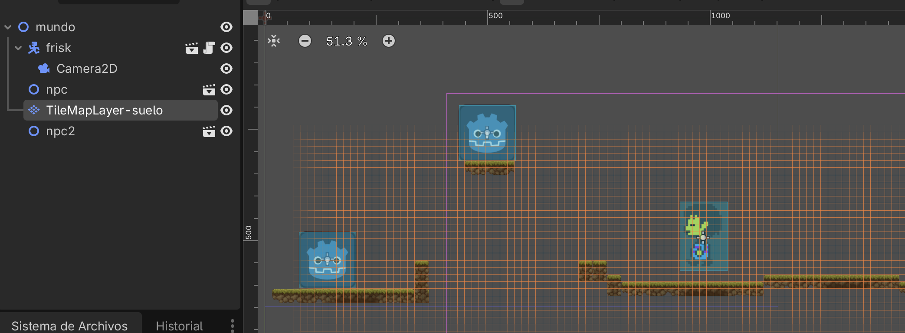
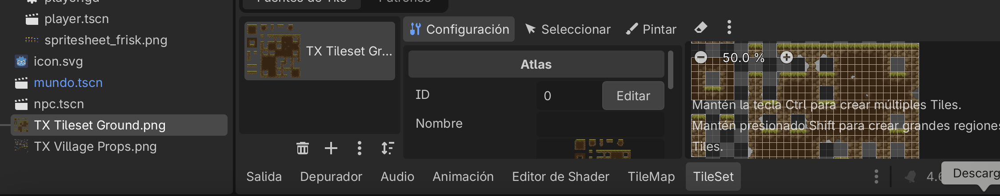
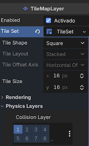

Creación de un Mundo con 

- Player (``CharacterBody2D``)que no tiene gravedad.

- NPC (Non-playable character con ``StaticBody2D``)

- Creación del Mundo (Niveles) con ``TilemapLayer`` 




* Descargar EJEMPLO: [Player-NPC-Tilemap.zip](player-npc-tilemap.zip)


## Creación del mundo con TilemapLayer

###  Tilemap 

- ¿Qué es un Tilemap? [Tilemap](https://github.com/mgea/godot/wiki/Tilemap)
- Recursos de Tilemap Sheets: https://itch.io/game-assets/free/tag-tilemap
- Ejemplo:
  
  
  - Link: https://cainos.itch.io/pixel-art-platformer-village-props

## Configurar TileMapLayer

Creamos un nodo de tipo ``Node2D>TileMapLayer`` y en la propiedad ``TileSet`` indicamos que vamos a crear uno nuevo. 

Una vez creado, nos **aparece en la ventana inferior dos nuevos paneles**: 


### Panel TileSet

EN este panel definimos los grupos (atlas) de bloques y sus propiedades. Pasos: 

* **Configuración de Textura (Setup)** Al importar la imagen se define cómo se divide para crear el _Atlas_: Seleccionas la imagen y Godot identifica los cuadros automáticamente. Se puede elegir qué partes de la imagen son tiles usables y cuáles ignorar (como espacios vacíos).




* **Capas de Física** (Physics Layers). Se añade información de los bloques que responden a una colisión y se almacena en una capa (layer)




### Panel TileMap
Es un sistema de "dibujo", Seleccionamos uno o más bloques y los vamos "pintando" en el escenario. 


## Creación de personajes NPC 

Estos NPC son objetos rígidos con los que puede colisionar el player. Cuando con la función ``physics_process`` se puede controlar qué hacer en casos de colisión (usar en lugar de __process_) 


```gdscript
# dentro de script de player.gd
func _physics_process(delta: float) -> void:
	# Add the gravity.
	get_input()
	var colision = move_and_collide(velocity * delta)
	# variable colision==true ha colisionado
	if colision:
		print("he chocado con ", colision.get_collider().name)
    # añadir acción... 

```


