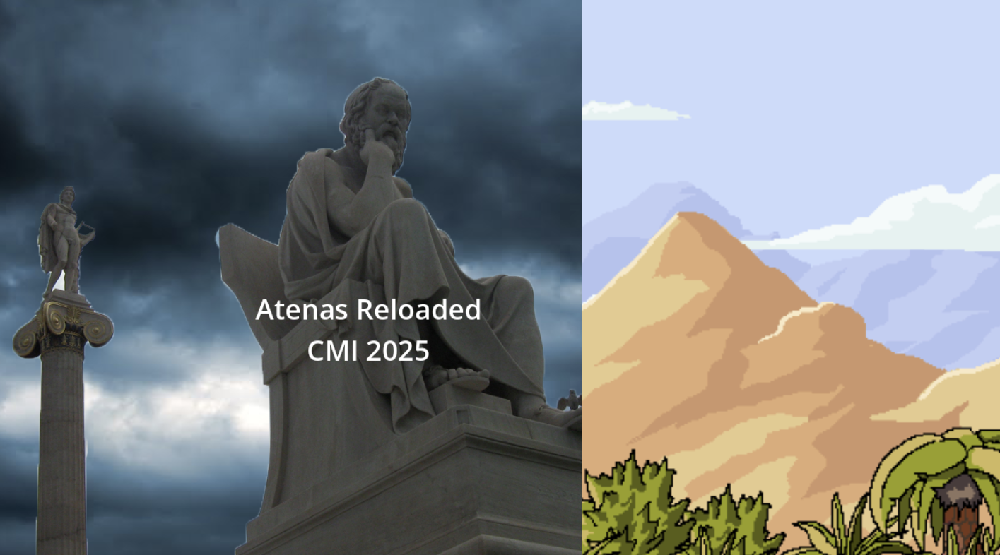
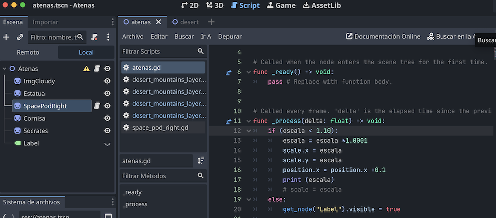

## Proyecto 03 - Atenas Reloaded, 20025

Segmentación de la imagen por capas. 

Basado en: 

###  Objetivos 

* Comprender cómo hacer la segmentación de una imagen en capas
* Cómo cambiar propiedades de otros nodos del arbol 
* Aplicar métodos de Parallax Scrolling (primera aproximación) 

### Segmentar imagen en capas 

* Utilizar herramientas como photoshop para segmentar imagen en capas para componer en Godot
* Aplicar movimiento a los nodos
* Para establecer propiedades de otros nodos: se debe usar **get_node()** https://kidscancode.org/godot_recipes/3.x/basics/getting_nodes/
  

### Parallax Scrolling 

Basado en: https://docs.godotengine.org/es/4.x/tutorials/2d/2d_parallax.html
Más información en:  https://www.youtube.com/watch?v=f8z4x6R7OSM

Recursos (OpenGameArt): https://opengameart.org/content/multilayer-scroll-backgrounds

### Publicación en itch.io

https://cmiugr.itch.io/atenas
