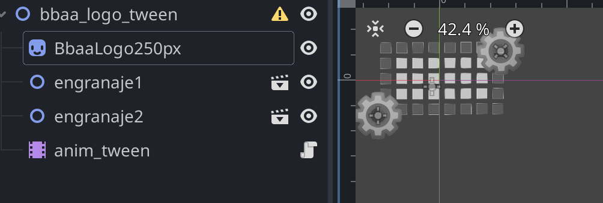

# BBAAteaser

Creación de un teaser (animación sin intervención del usuario) 

###  Objetivos 

* Comprender cómo hacer animacion usando keyframes 
* Comprender reutilización de componentes con animación (jerarquías)

### Jerarquía de animaciones: coche

EL coche consta de dos ruedas que giran constantemente. 

Crear una "escena" coche con carrocería y dos instancias de la "escena" de una rueda que gira

* escena: rueda.tscn

* escena: coche.tscn 

### Animaciones: entrada de bellas artes 

Animación donde se hace un zoom-in mientras que el coche cruza la calle 

La escena contiene: 

* imagen de fachada
* instancia de coche.tscn
* nodo ``animationPlayer`` que controla
   * animación de la fachada
   * movimiento del coche

### Animaciones anidada: logotipo de cmi-bbaa con multiples animaciones 

En este caso hay que ir componiendo parte por parte. 
* engranaje.tscn (engranaje que gira constantemente)
* logobbaa.tscn (que contiene dos engranajes que se mueven en horizontal)
* logobbagirando.tscn (que gira sobre sí mismo)
* logobbaatexto.tscn (que tiene un logobbaagirando.tscn y texto que tambien se mueve) 

### Información sobre animación:

https://github.com/mgea/godot/wiki/Animation

### Publicación en itch.io

https://cmiugr.itch.io/bbaa-animated
