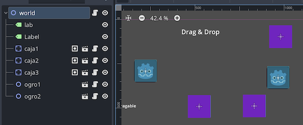
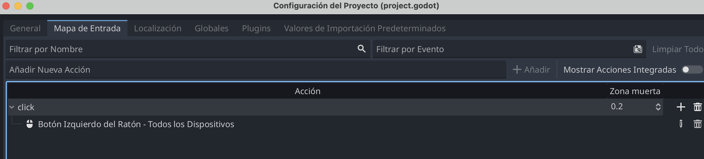
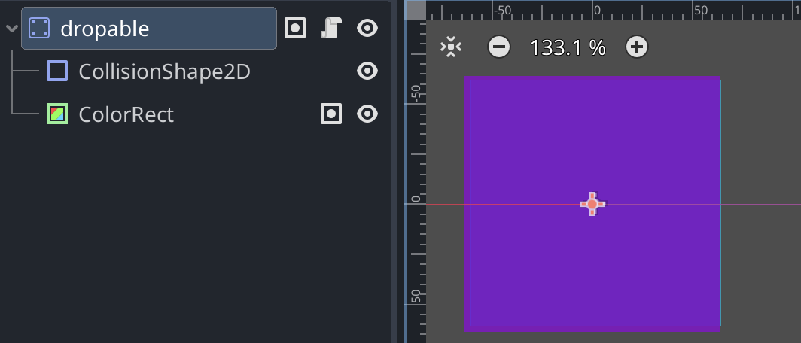
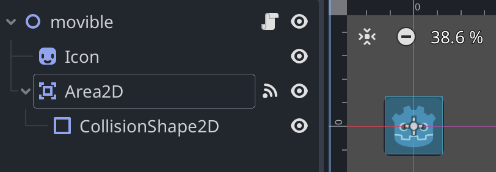

# Drag&Drop 

Video tutorial: https://www.youtube.com/watch?v=uhgswVkYp0o

Descargar [Código ejemplo](dragdrop.zip)

Ver en Itch.io -> https://cmiugr.itch.io/dragdrop




Creamos dos tipos de objetos: 

- Huecos: áreas donde soltar  (**dropable.tscn**)
- Moviles (**movible.tscn**) son objetos que se puede mover con el ratón. 


### Variables globales 

Todos los objetos de la escena deben saber si hay un objeto moviéndose. Creamos uns variable global que se debe meter en un guión (globales.gd) que contiene: 

```
extends Node2D
var is_dragging = false
```

Para que funcione como variable global, hay que incluir este script en **Configuracion del proyecto>Globales**, que permite añadir scripts.


> ¿qué son las variables globales y cómo crear? (https://github.com/mgea/godot/wiki/Variables#variables-globales) 


### Funciones de Input: ratón 

Del mismo modo, vamos a **Configuracion del proyecto>Mapas de entrada** y podemos crear un nombre de input personalizado ("click") asociado al Botón Inzquierdo del Ratón. Más adelante usaremos este nombre para saber si se ha pulsado el botón del mouse.




### Huecos (dropable.tscn)

Los huecos son  objeto estáticos formados por un área de colisión y un rectángulo con color (tambien podría ser una imagen)

```
StaticBody2D
|- CollisionShape
|- ColorRect 
```



EL script asociado permite "activar" las zonas (pasar de color invisible a visible) cuando haya algun objeto arrastrándose, de modo que indicamos dónde podriamos ubicarlo. 


```
extends StaticBody2D

# Called when the node enters the scene tree for the first time.
func _ready() -> void:
  ## color de inicio
	modulate = Color(Color.MEDIUM_PURPLE, 0.4)

# Called every frame. 'delta' is the elapsed time since the previous frame.
func _process(delta: float) -> void:
  # al iniciar juego, se pone no visible si no hay objetos seleccionados
	if global.is_dragging:
		visible=true
	else:
		visible=false

```

Grupo: **dropable**

Todos los objetos que actúan como huecos pueden agruparse mediante una etiqueta. Para ello, dentro de las propiedades de señales, hay una opcion de grupos. Creamos un nuevo grupo llamado **dropable** (lugar donde colocar un objeto movible) y activamos.  


### Móviles (movible.tscn)


```
Nodo2D
|- Sprite2D
|- Area2D
  |-- CollisionShape2D
```

El movible tiene una imagen (sprite2D) y un área que permite detectar si ha colisionado o no. 




### Variables

Variables internas necesarias para conocer datos del objeto: 

```
extends Node2D

var draggable = false           # saber cuando mouse esta encima de objeto
var is_inside_dropable = false  # saber si encima de un area para soltar
var body_ref
var offset: Vector2
var initialPos : Vector2        ## Posicion inicial
```


### Señales 

Activamos 4 señales (del **Area2D**): 

Señales relacionadas con entrar/salir el mouse en el objeto movible (pero todavía no se a presionado botón de ratón). Se puede hacer una pequeña animacián para indicar que se puede seleccionar con estas dos señales: 

* CollisionObject2D::mouse_entered
* CollisionObject2D::mouse_exited

```
# funciones para activar/desactivar movible

func _on_area_2d_mouse_entered() -> void:
	# el mouse esta sobre objeto (si no se esta moviendo, activar)
	if not global.is_dragging:
		draggable=true
		scale = Vector2(1.05, 1.05) 


func _on_area_2d_mouse_exited() -> void:
	# el mouse sale del objeto (si no se esta moviendo, desactivar)
	if not global.is_dragging:
		draggable=false
		scale = Vector2(1, 1) 

```


Y las señales para saber si tenemos que dejar el objeto en un hueco (dropable.tscn)

* Area2D::body_entered          (entra o solapa el área de otro objeto)
* Area2D::body_exited             (sale del área de otro objeto)

Activamos la variable ``is_inside_dropable`` para que se consulte cuando se suelte el botón del mouse. También guardamos la referencia al objeto con el que hemos "colisionado"

```
func _on_area_2d_body_entered(body: Node2D) -> void:
	if body.is_in_group("dropable"):
		is_inside_dropable = true
		body_ref = body
	
func _on_area_2d_body_exited(body: Node2D) -> void:
	if body.is_in_group("dropable"):
		is_inside_dropable = false
		body.modulate = Color(Color.MEDIUM_PURPLE, 0.7)

```


Acciones de proceso (en cada instante) para saber qué hacer usando ``_process()``

Es un poco más compleja, pero básicamente lo que hace es  **mover objeto** (actualizar la posicion del objeto con la posición del mouse) **si está seleccionado**. 

Si se presiona el botón de mouse, se activa el arrastre (variable ``global.is_dragging=true``)  y si se suelta se deja de mover. Si cuando se suelta está colisionando con un hueco (``is_inside_dropable`` es true) se hace una pequeña animacion para colocarlo en ese lugar. 


```
func _process(delta: float) -> void:
	if draggable:
		if Input.is_action_pressed("click"):
			global_position = get_global_mouse_position()
			global.is_dragging=true
		elif Input.is_action_just_released("click"):
			global.is_dragging=false
			var tween = get_tree().create_tween()
			if is_inside_dropable:
				tween.tween_property(self,"position", body_ref.position, 0.2).set_ease(Tween.EASE_OUT)		
			else:
				tween.tween_property(self,"position", initialPos, 0.2).set_ease(Tween.EASE_OUT)		
				


```


Las variables que controlan todo el movimiento son: 

* ``global.is_dragging=true``   si se está moviendo con el ratón, false en caso contrario
* ``is_inside_dropable= true`` si se ha colisionado con un objeto que es de tipo hueco (y pertenece al grupo de "dropables")
* ``draggable=true`` si el mouse está "encima" del objeto movible pero todavía no se ha pulsado click (esta preparado para el movimiento)

 


