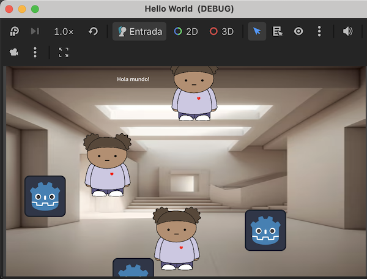
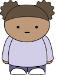
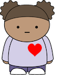
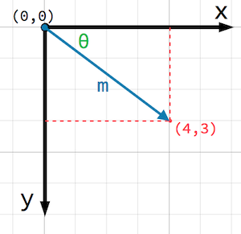
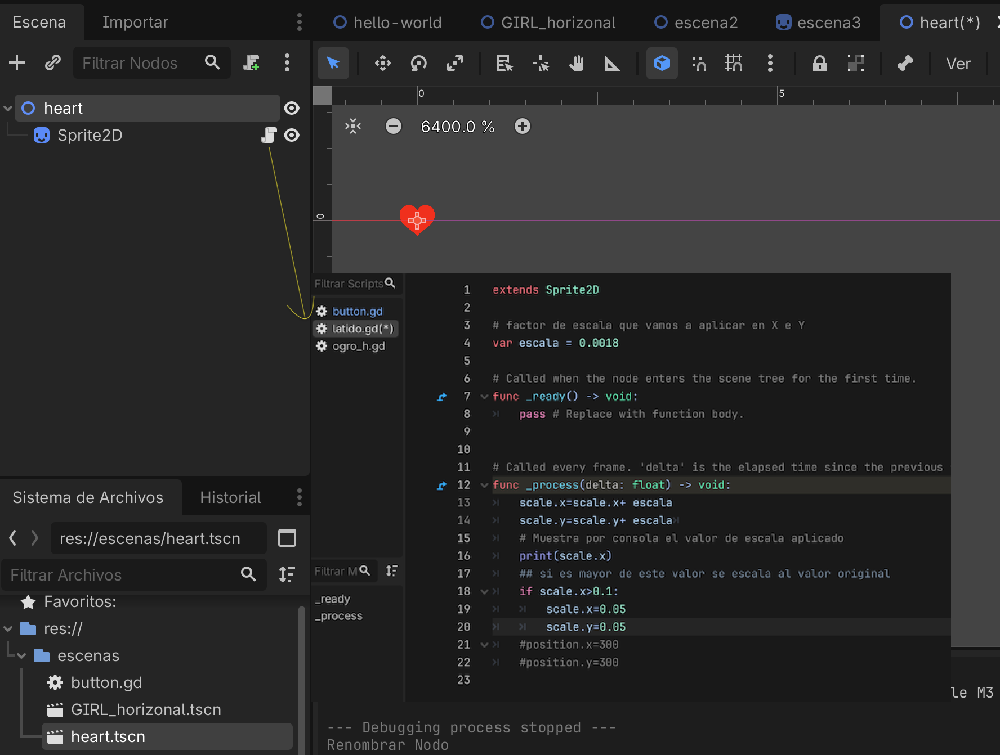
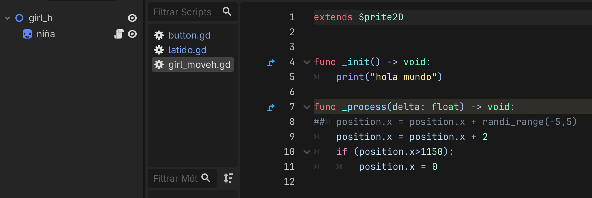
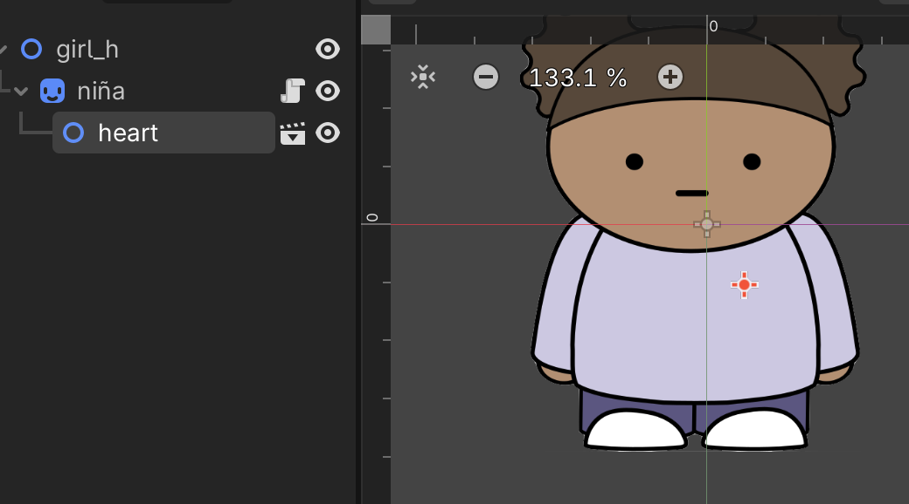
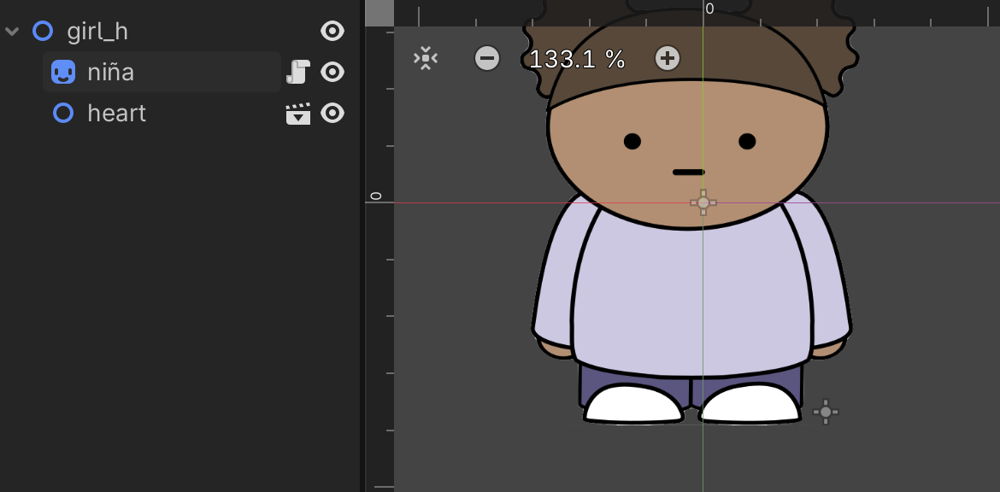

## Proyecto 02 - Hello Girl  


Basado en: https://docs.godotengine.org/es/4.x/getting_started/step_by_step/scripting_first_script.html

Extensión de ejercicio [Hello World](../hello_world)

###  Objetivos 

* Comprender la jerarquía de objetos
* Crear un objeto 2D compuesto con dos animaciones sencillas anidadas 
* Comprender las operaciones básicas de un Node2D que se heredan a un Sprite2D (Sprite2D < Node2D)




Los ogros se mueven en vertical y las niñas se mueven en horizontal con corazón palpitando.

### Composición de Heart_Girl Sprite 2D 

Para crear a la niña con corazón palpitando necesitamos estos assets. 

   
 
### Operaciones básicas sobre un Node2D

En primer lugar hay que tener en cuenta las coordenadas de la vista (viewport). El origen (0,0) está en esquina superior izquieda, y el tamaño se fija en la configuración del proyecto (por defecto es 1158x648px)



Las operaciones básicas son: 

```GDScript
# Posición en canvas. 
position.x = 10
position.y = 10
# Escala en eje x e y independiente. Es un factor multiplicador, si escala = 1 igual tamaño 
scale.x = 1
scale.y = 1
# Rota el objeto a 45 grados
rotation_degrees = 45 
```

### Crear latido del corazón. Escena heart.tscn

EL latido de corazón será una **escena** que va a tener como comportamiento hacer que el corazón palpite. Para ello vamos a usar como operación la escala de la imagen del corazón en un intervalo. Cuando llegue a un tamaño que consideremos suficiente, volvemos a escalar a su valor inicial para crear efecto de movimiento. 

Hay que tener cuidado con los tamaños de los objetos originales (tamaño de imagen), ya que la escala depende de su posiciones iniciales. Los puntos importantes a tener en cuenta son: 

- tamaños relativos de la imagen de la niña orignial y de la imagen del corazón para saber cómo aplicar escalado
- Ubicación del objeto (corazon) en pantalla. Si no está centrado en el origen de coordenadas puede sufrir desplazamiento
- Incrementos (para que el corazón no vaya ni muy rápido ni muy lento)
- tamaño final de escala (para que vuelva a su estado original) 

Para ajustar todos esos datos, es recomendable **visualizar por Consola** los valores actuales de escalado aplicado. 



Es importante darse cuenta que los valores de factor de escala ``var escala = 0.0018`` y la condición de finalización de ampliación ``if scale.x>0.1:`` deben ser ajustados dependiendo de los tamaños de la imagen original, para ello, es importante mostrar el factor de escala actual por Consola ``print(scale.x)`` para ver cuanto es el tamaño actual. 
La imagen está situada en el origen de coordenadas. Si la queremos ver mejor mientras ajustamos las escalas podríamos mover a una posición concreta con ``position.x=300`` y  ``position.y=300`` pero que tenemos que quitar (por eso están como comentarios) cuando finalicemos el ajuste.


```GDScript
extends Sprite2D
# latido.gd  

# factor de escala que vamos a aplicar en X e Y 
var escala = 0.0018 

# Called when the node enters the scene tree for the first time.
func _ready() -> void:
	pass # Replace with function body.


# Called every frame. 'delta' is the elapsed time since the previous frame.
func _process(delta: float) -> void:
	scale.x=scale.x+ escala
	scale.y=scale.y+ escala	
	# Muestra por consola el valor de escala aplicado
	print(scale.x)
	## si es mayor de este valor se escala al valor original
	if scale.x>0.1:
		scale.x=0.05
		scale.y=0.05 
	#position.x=300
	#position.y=300

```


### Girl con movimiento 


La siguiente escena es crear la niña, que va a tener un movimiento asociado (mover en horizontal por ejemplo). La forma de hacerlo es similar al ejercicio [Hello World](../hello_world)   

   


### Girl con corazon 

Finalmente, añadimos una instancia del ``heart.tscn`` a la niña, pero es importante saber cómo organizar la jerarquía de nodos en la escena. Las dependencias hace que se hereden comportamientos por lo que en este caso el corazón se moverá con la niña (es una escena anidada) 

   


Mientras que en este otro, el corazón se quedará en la misma posición (no se moverá con la niña), ya que no hereda ese comportamiento. 

   


---

*Ejercicio realizado en clase por primera vez el 12/03/2026*

