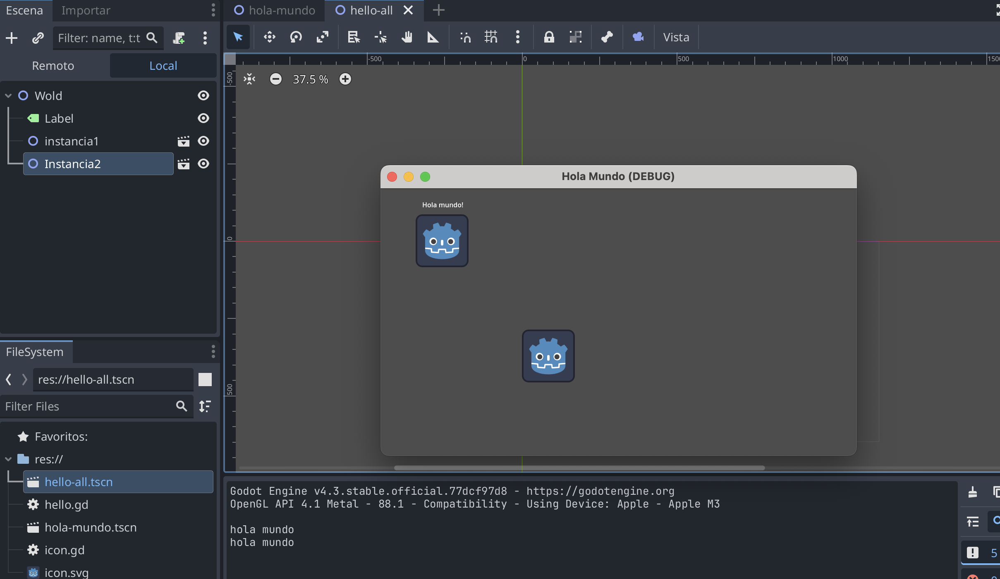
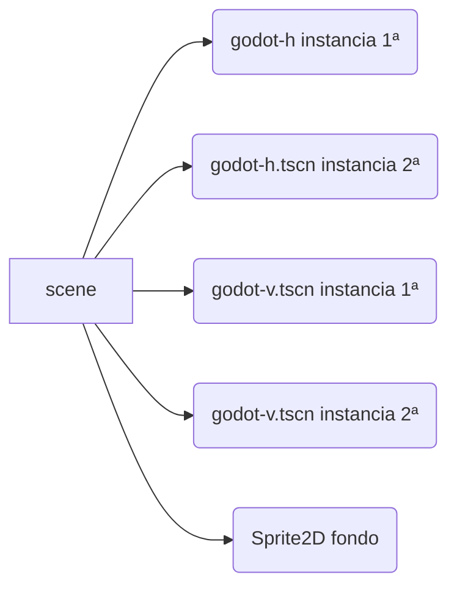

## Proyecto 01 - Hello World  


Basado en: https://docs.godotengine.org/es/4.x/getting_started/step_by_step/scripting_first_script.html



###  Objetivos 

* Comprender la jerarquía de objetos
* Crear un objeto con animación 2D
* Asociar un script a un objeto
* Comprender las funciones de notificación de objetos
* Usar fuciones de consola
* Crear una nueva escena con instancias 


### Mostrar Sprite 2D 

Un **Sprite 2D** es un asset/recurso de tipo imagen,   Node2D > Sprite2D

Vamos a crear un Sprite2D que se va a mover en horizontal (godot-h) de modo que cuando salga por la derecha de la vuelta 

### Pasos Escena 1: logo de godot con movimiento horizontal

https://docs.godotengine.org/es/4.x/getting_started/step_by_step/scripting_first_script.html 


* Creación del Nodo 


* Asociar (**attach**) un script

 


* Escribir script (usando función de inicio por defecto)


```
extends Sprite2D

func _init():
	print("Hello, world!")
```


* Guardar como escena (Menu > Escena > Guardar Escena )  con extensión ``.tscn``  (``godot-h.tscn``)

en el código (script) quedaría así, y tambien se guarda como recurso con extensión ``.gd`` (``godot-h.gd``)  

``` 
extends Sprite2D

func _process(delta: float) -> void:
	position.x = position.x + 2 
	if (position.x>1150):
		position.x = 0

```


### Pasos Escena 2: logo ogro con movimiento vertical

Creamos nuevamente otra escena con una imagen de godot pero que ahora su script (``godot-v.gd``) le permite moverse en vertical y se guarda como escena  (``godot-v.tscn``)


### Paso Escena 3 con la composición final 

La composición final incluye múltiples instancias de escenas de godots que se mueven en horizontal (``godot-h.tscn``) y en vertical (``godot-v.gd``)




### Posibles mejoras 


* se puede cambiar la posición del objeto con la función random - [randi](https://docs.godotengine.org/en/stable/classes/class_randomnumbergenerator.html) 


```
extends Sprite2D

func _process(delta: float) -> void:
	position.x = position.x + 2 
	if (position.x>1150):
		position.x = 0
                # La posicion vertical al volver a inicio cambia aleatoriamente en este rango 
		postion.y = randi_range(10,200)

```


### Publicación en itch.io 

https://cmiugr.itch.io/hello-world 

  


