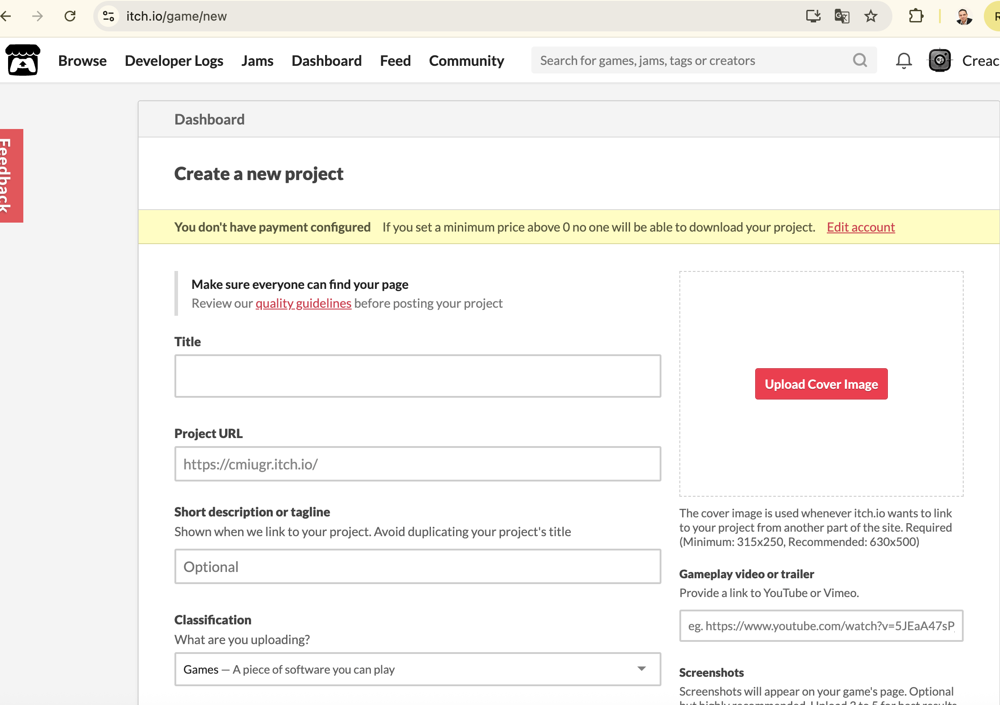
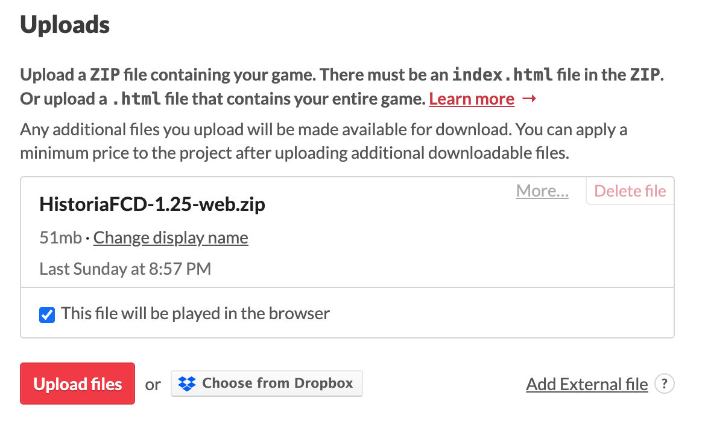
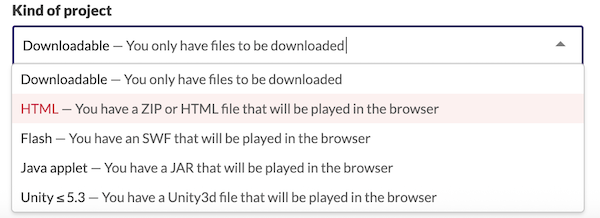
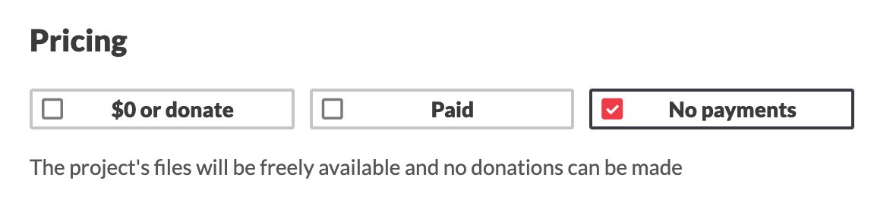
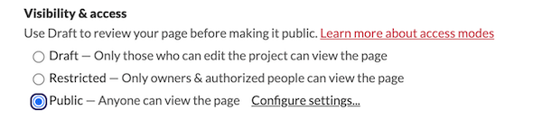

# Publicar en itch.io 

Itch.io es una plataforma en línea y mercado abierto, líder para encontrar, vender y descargar videojuegos independientes, centrada en desarrolladores pequeños o individuales. 

Permite subir juegos, herramientas, recursos (assets) y música sin restricciones, a menudo con modelos de "paga lo que quieras", siendo un pilar fundamental para proyectos experimentales y game jams

Vamos a preparar nuestros proyectos para subirlos: 

### 1 Preparación de carpeta para subir a Itch.io

La exportación de proyectos HTML se debería hacer del siguiente modo:

* Exportar a HTML en una nueva carpeta
* Renombrar el fichero .html a index.html
* comprimir a ZIP

### 2 Crear cuenta en Itch.io

Se hará una publicación del proyecto en exportación  WEB que subiremos a itch.io (https://itch.io/). Para ello, nos haremos una cuenta donde subiremos el proyecto exportado en formato zip. 

Hay que tener en cuenta los siguiente:

 
 

Los pasos a seguir son los siguientes: 

#### 3.1 Completar datos del juego 

* Título del proyecto (se usará para crear la URL para acceder al juego)
* URL -> Se crea con el nombre del usuario y nombre del juego 
* Subir una **Imagen de portada**  (Cover Image) que ayuda a reconocer el juego.
* Descripción del juego 

#### 3.2 Subir fichero comprimido (zip) 

Contiene todo el proyecto exportado a html y comprimido en un **zip**

EL nombre del la página web inicial debe ser obligatoriamente **index.html**

En muchos casos, cuando exportamos con Godot, se crea un html con el nombre del proyecto. **HAY QUE RENOMBRAR A index.html**

 
 

### 3.2 Tipo de contenido 

Hay que indicar qué se puede hacer con ese proyecto. Lo normal es descargarlo o mostrarlo directamente  en el servidor. 

Indicar que es un **tipo de proyecto HTML** (no un descargable) que se puede mostrar en el navegador directamtente

### 3.4 Pagos 

Indicar de **no tiene pago asociado** (para no tener que darnos de alta en servicio de pago)

### 3.5 Visibilidad 

Hacer el **proyecto PÚBLICO** para que cualquiera lo pueda visualizar 

