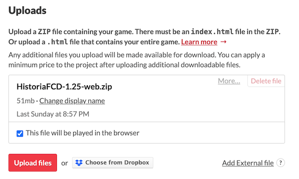

# Publicar en itch.io 

ItchIO es un ... 

Se hará una publicación del proyecto en exportación  WEB que subiremos a itch.io (https://itch.io/). Para ello, nos haremos una cuenta donde subiremos el proyecto exportado en formato zip. 

Hay que tener en cuenta los siguiente:

Indicar que es un tipo de proyecto HTML (no un descargable) que se puede mostrar en el navegador directamtente

