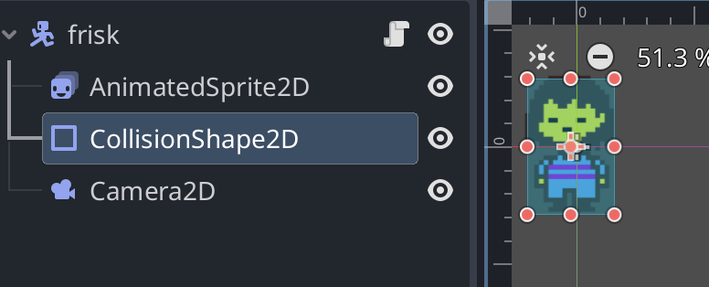
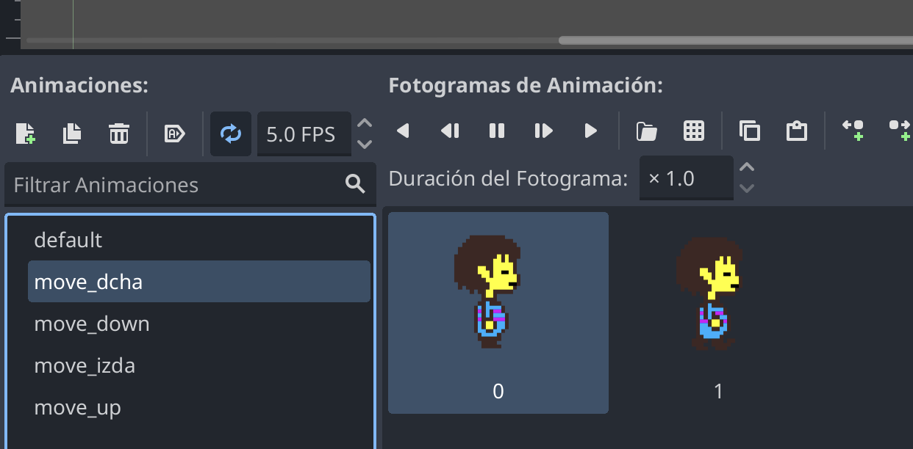
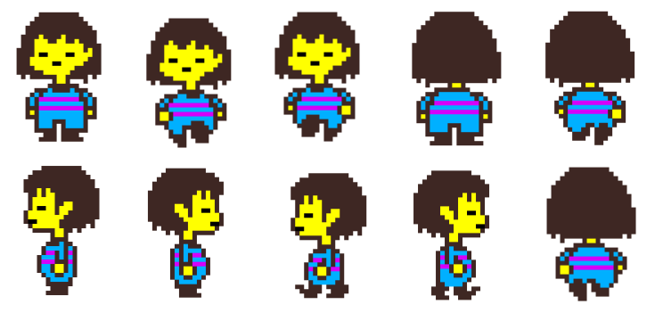

# Mover Player con animación propia 

Es un caso muy similar a [moveSprite](../moveSprite) pero cambiando el Sprite por un AnimatedSprite2D.

Código en zip (versión Godot 4.4) [walkingPlayer.zip](walking_player.zip)

Pasos: 

### 1  Creamos el player con animación propia



### 2 Creamos las animaciones internas

Animaciones propias del nodo ``AnimatedSprite2D``

Se puede usar un spritesheet para cargar de modo más rápido las imágenes de movimiento 



Para crear las animaciones, es buena idea tener un spritesheet con todas las poses del personaje: 




### 3 Activamos los inputs o mapas de entrada (en configuración del proyecto)

Se pueden activar y usar el mapa de entradas por defecto. vamos a mover player con los valores por defecto para cursores "ui_left", "ui_right", "ui_top", "ui_bottom"

Se pueden crear mapas específicos de entrada (dando un nombre y asociando los inputs) 

Video ejemplo de cómo personalizar inputs: https://www.youtube.com/watch?v=52aG2CLgOck 

### 4 Creamos script del player para movimiento y colisión 

frisk.gd contine dos funciones: 

- ``get_input()`` es una función para saber qué dirección toma el personaje mediante un vector. Ese vector se calcula sabiendo qué teclas se han pulsado izda-dcha-up-down y dará 8 direcciones. Se multiplica ese valor por una constante de velocidad (speed) que podemos variar. 

- ``_physics_process()`` es una función de los ``CharacterBody2D`` que permite calcular cómo debe actuar (movimiento y colisiones). Debemos saber qué tecla se ha pulsado (por ejemplo Input.is_action_just_pressed("ui_right") ) para activar la animación correspondiente. Si se suelta alguna de esas teclas Input.is_action_just_released("soltar_tecla"), se vuelve a posición de reposo ("defaul"). Por ahora imprime en la consola si ha colisionado con algún objeto sólido (StaticObject2D)


Modo básico 
```
extends CharacterBody2D

const SPEED = 300.0

func _physics_process(delta: float) -> void:
	var vector = Input.get_vector("ui_left", "ui_right", "ui_up", "ui_down")
	velocity = vector * SPEED
	move_and_slide()
```

Si queremos además animar al personaje. debemos poner en play su animación en la dirección que se mueva (con la señal ``Input.is_action_just_pressed`` según la tecla que se pulse: 


```
extends CharacterBody2D


const speed = 300.0


func get_input():
	var input_direction = Input.get_vector("ui_left", "ui_right", "ui_up", "ui_down")
	velocity = input_direction*speed
	if Input.is_action_just_pressed("ui_right"):
		$AnimatedSprite2D.play("move_dcha")
	if Input.is_action_just_pressed("ui_left"):
		$AnimatedSprite2D.play("move_izda")
	if Input.is_action_just_pressed("ui_up"):
		$AnimatedSprite2D.play("move_up")
	if Input.is_action_just_pressed("ui_down"):
		$AnimatedSprite2D.play("move_down")
	if Input.is_action_just_released("soltar_tecla"):
		$AnimatedSprite2D.play("default")


func _physics_process(delta: float) -> void:
	# Add the gravity.
	get_input()
	var colision = move_and_collide(velocity * delta)
	# variable colision==true ha colisionado
	if colision:
		print("he chocado con ", colision.get_collider().name)
	else:
		print("")
	# move_and_slide()

```


### 5 Mover y colisión 

Tenemos dos funciones dentro de ``_physics_process``: 
* ``move_and_slide()`` hace que se mueva el personaje con la aceleración indicada y colisiona (pero no hace nada más)  
* ``move_and_collide()`` además es capaz de saber con qué objeto ha colisionado

