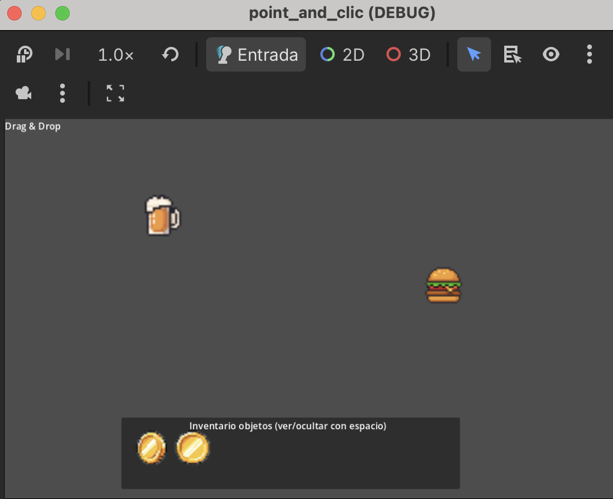
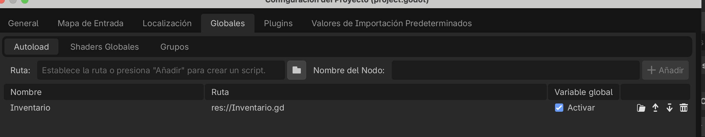

# Point & Click


* Ejemplo en itch.io -> https://cmiugr.itch.io/point-and-click

* Descargar ejemplo -> [point_click.zip](point_click.zip) 



## Creamos un objeto coleccionable 

El objeto coleccionable tiene las señales para saber si el mouse está in / out (cambio de tamaño) con señales 
Además detecta clic dentro de Area2D 
Las variables que empiezan con ``@export`` se pueden añadir desde el Inspector (por ejemplo la textura, el nombre, etc.) 

```
Coleccionable (Node2D)
 ├── Area2D
 └── ColisionShape
     └── Sprite2D
```


```gdscript

extends Node2D


@export var nombre_objeto:String
@export var texture:Texture2D

@export var escala_normal: Vector2 = Vector2(1, 1)
@export var escala_grande: Vector2 = Vector2(1.2, 1.2) # 20% más grande
@export var tiempo_animacion: float = 0.2
@onready var sprite = $Area2D/Sprite2D


# Called when the node enters the scene tree for the first time.
func _ready() -> void:
	print(texture)
	$Area2D/Sprite2D.texture = texture
	$Area2D/Sprite2D.visible = true
	

# Called every frame. 'delta' is the elapsed time since the previous frame.
func _process(delta: float) -> void:
	pass

func _on_area_2d_input_event(viewport: Node, event: InputEvent, shape_idx: int) -> void:
	if event is InputEventMouseButton and event.pressed:
		print("dentro")
		if event.button_index == MOUSE_BUTTON_LEFT:
			recoger_objeto()
					

func recoger_objeto():
	print("Has recogido: ", nombre_objeto)
	queue_free() # Elimina el objeto de la escena
	# Añado al inventario que -> Variable global 
	Inventario.items.append(nombre_objeto)

## animación cuando entra ratón
func _on_area_2d_mouse_entered() -> void:
	var tween = create_tween()
	tween.tween_property(self, "scale", escala_grande, tiempo_animacion).set_trans(Tween.TRANS_SINE)
	print("in")

## animación cuando sale ratón
func _on_area_2d_mouse_exited() -> void:
	# Volvemos al tamaño original
	var tween = create_tween()
	tween.tween_property(self, "scale", escala_normal, tiempo_animacion).set_trans(Tween.TRANS_SINE)
	print("out")


```


## Creamos un Inventario (fichero Inventario.gd) como variable global 

* El inventario es un panel que se puede abrir / cerrar con la barra de espacio 
* Cada vez que se coge un objeto, se añade a la lista
* Se añade el nombre del objeto y se visualiza la imagen (que tiene el mismo nombre)
* Se crea como variable global




por ejemplo: se almacena "burguer" y se coloca en inventario ``res://assets/burguer.png``


```
Node2D
 ├── Coleccionable
 ├── Coleccionable
 ├── Coleccionable
 └── CanvasLayer
     ├── Panel 
     └── Label
```

```gdscript
extends Node2D


@onready var ui = $CanvasLayer
var abierto = true

func _ready() -> void:
	pass # Replace with function body.


# Abre el panel de objetos con tecla de espacio
func _process(delta: float) -> void:
	if Input.is_action_just_pressed("ui_accept"): # normalmente ESPACIO
		# conmuta abierto/cerrado	
		abierto = !abierto 
		# muestra o no 
		ui.visible = abierto
	if abierto:
		actualizar_ui()

### actualiza elementos que deben aparecer en inventario cada vez que se abre
func actualizar_ui():
	# elimono los actuales
	var offset_x = 70
	var start_pos = Vector2(20, 20)
	var i=0
	for c in $CanvasLayer/Panel.get_children():
		c.queue_free()
	# pongo los recolectados
	for item in Inventario.items:
		var icon = TextureRect.new()
		icon.texture = load("res://assets/" + item + ".png")
		icon.custom_minimum_size = Vector2(64,64)
		$CanvasLayer/Panel.add_child(icon)
		icon.position = start_pos + Vector2(offset_x * i, 0)
		i += 1


```


Repositorio de coleccionables. https://pixelrepo.com/collections/free


