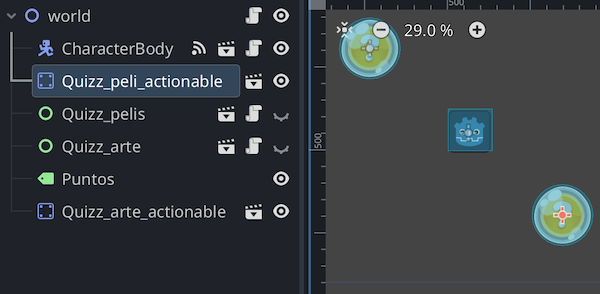
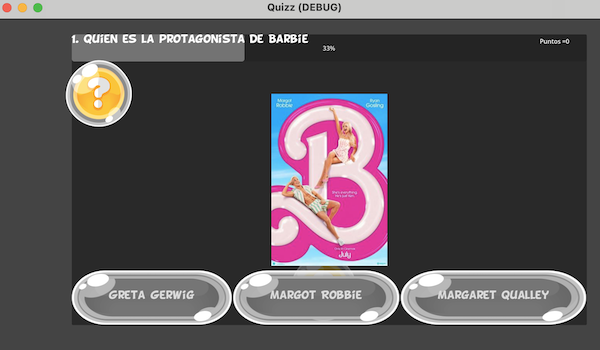

# QUIZZ 
### juego de acertar varios trivial de preguntas 


Juego completo 
Codigo fuente (juego de varios quizz) - [quizz_game](quizz.zip)
Demo en Itch.io -> https://cmiugr.itch.io/quizz


<br>
<br>


### Utilidades 

*  Codigo fuente (panel individual de quizz) - [quizz_panel](quizz_panel.zip)
*  Versión 2 que almacena datos en fichero json -  [quizz_panel json](quizz_panel_json.zip)

   


Demo en Itch.io -> https://cmiugr.itch.io/quizz

* Juego donde se activan los quizz temáticos cuando el player choca con objetos de tipo "?"
* Para ello se ha creado: 
  * player  (KinematicPlayer2D)
  * Quizz_peli_actionable (StaticObject2D)
  * Quizz_arte_actionable (StaticObject2D)
  * Quizz_pelis instancia de un Panel UI de tipo QUIZZ 
  * Quizz_arte instancia de un Panel UI de tipo QUIZZ  


Actividades: 

* Crear una **panel de tipo UI** (Control) que se puede **mostrar/ocultar** de tipo Quizz y con **tema personalizado**, con la siguiente estructura de preguntas con: 
	* nombre de pregunta 
	* imagen
	* tres posibles respuestas
* crear **señales personalizadas**,  se emiten cuando se choca con el objeto para abrir Panel de preguntas  https://www.youtube.com/watch?app=desktop&v=vFO2hSu_4kg
	* crear una variable de tipo signal, ejemplo ``signal signal_call_arte`` 
	* llamar a la función ``signal_call_arte.emit()``
* Dispone de **script global** ``global.gd``donde se almacenan los puntos totales
* Se han creado **dos instancias de escena de quizz** ``UI_quizz.tscn`` para crear dos trivial diferentes: de arte y películas. 
* Activar movimiento del player y dependiendo de donde colisione, activar un quizz u otro 

```python
var colision = move_and_collide(velocity * delta)
	if colision: 
		print(colision.get_collider().name)
		if (colision.get_collider().name == "Quizz_peli_actionable"):
			signal_call_pelis.emit()
		if (colision.get_collider().name == "Quizz_arte_actionable"):
			signal_call_arte.emit()
```

* **Desactivar quizz** si se han hecho previamente 

```python
#en ui_quizz_art.gd

func _on_bt_salir_pressed() -> void:
	Global.puntos_totales += aciertos
	_ready()	# reiniciar
	por_hacer = false # no se vuelve a repetir
	visible = false # se oculta


# en world.gd
func _on_character_body_2d_signal_call_pelis() -> void:
	if ($Quizz_pelis.por_hacer):
		$Quizz_pelis.visible = true
```
