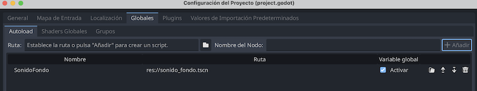

# Sonido 

El sonido se puede usar como fondo (acompañando a la escena) o también para efectos como por ejemplo la pulsación de un botón. 


Vamos a usar un ``AudioStreamPlayer``


Cómo añadir un sonido desde script: 


<br>
<br>

### Sonidos de fondo (GLOBAL)

Un sonido ambiente funciona bien para una escena, pero si pasamos a otra escena, el **sonido se corta**

Para evitar eso, hay que usar **scripts y escenas almacendas en GLOBALES** (está en Proyecto->Configuración del Proyecto > Globales)

Video de cómo poner sonido de fondo: https://www.youtube.com/watch?app=desktop&v=K_lAB8zqkvQ

Pasos:
  * creamos una nueva escena para gestionar el sonido de fondo
  * asociamos un script (gd) para almacenar funciones de manejo del sonido 


La escena (la he llamado **sonido_fondo.tscn**) sólo tiene dos ``AudioStreamPlayer``, cada uno con un fichero mp3 precargado (ver Inspector > Stream) 


Le añadimos un script (guión llamado **sonido_fondo.gd**) que contiene las funciones que vamos a llamar desde cualquier escena:

En esta escena se incluyen dos audios (o los que se necesiten) que se pueden activar con las siguientes funciones. 


```
# fichero sonido_fondo.gd
extends Node2D

# Called when the node enters the scene tree for the first time.
func _ready() -> void:
	pass # se podría activar un audio por defecto al inicio

func musica_fondo_off() -> void:
	$audio.stop()
	
func musica_fondo_on() -> void:
	$audio.play()

# conmutar permite cambiar de play/stop alternando 
func musica_fondo_conmutar()  -> void:
	if $audio.playing:
		$audio.stop()
	else:
		$audio.play()


func musica_fondo_volumen(vol:int) -> void:
	$audio.volume_db = vol

##### Audio alternativo (faltaría mas cosas como volumen...)

func musica_fondo_alternativo_on() -> void:
	$audio_alternat.play()

func musica_fondo_alternativo_off() -> void:
	$audio_alternat.stop()


```

Tareas que podemos hacer sobre el sonido de fondo: 

* activar/desactivar sonido de fondo
* subir/bajar volumen


### Añadir escena como global 

Para ello, nos vamos a ``Proyecto > Configuración del Proyecto > Globales`` y añadimos esta escena  en modo ``Autoload`` (le damos a la carpeta para buscarla) 


Al pulsar sobre el botón "+" se añade como global y crea una **variable global** que se puede usar desde cualquier sitio. En este caso se llama ``Sonidofondo``




